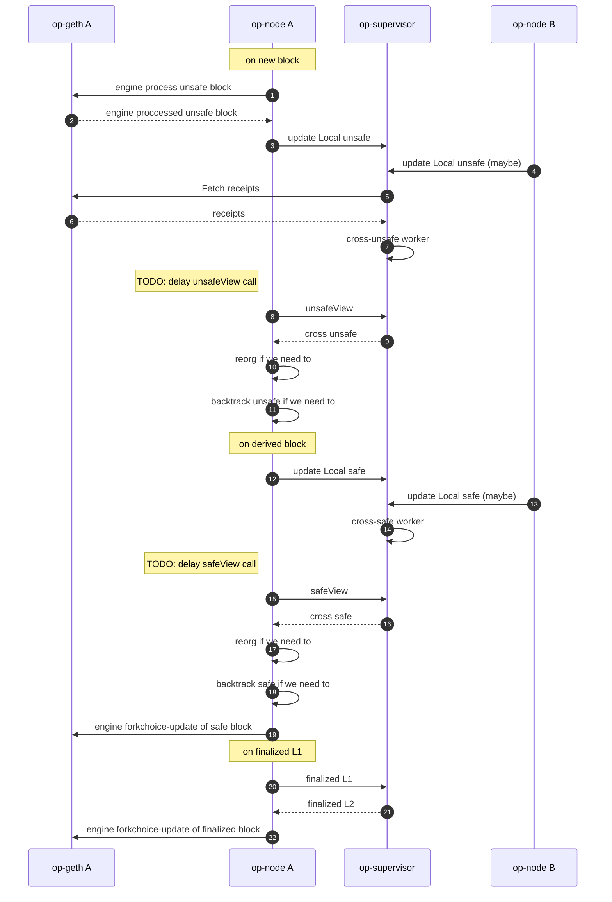
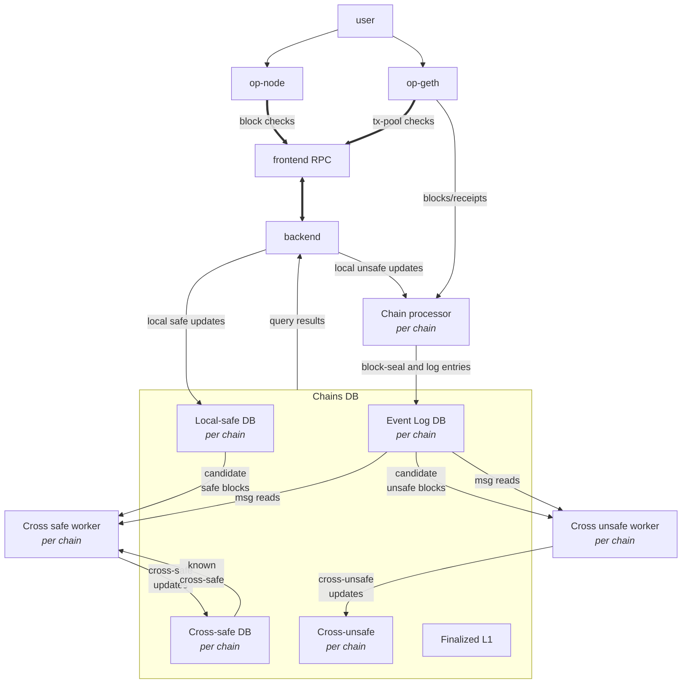

# op-supervisor

`op-supervisor` is a service to monitor chains, and quickly determine
cross-chain message safety, for native interoperability.
The `op-supervisor` functions as a [superchain backend], implementing the [interop specs].

[superchain backend]: https://github.com/ethereum-optimism/design-docs/blob/main/protocol/superchain-backend.md
[interop specs]: https://github.com/ethereum-optimism/specs/tree/main/specs/interop

## Overview

### About safety

There are 3 stages of block safety:

- `unsafe`: optimistically processed blocks
- `safe`: blocks reproducible from valid dependencies
- `finalized`: blocks reproducible from irreversibly valid dependencies

**Pre-interop**, the only dependency is DA (data availability), i.e. the batch data to derive the chain from.
**Post-interop**, other L2s may be a dependency also.
The op-supervisor tracks these dependencies, to maintain a global view of cross-chain message safety.

New blocks are considered `local unsafe`: sufficient to process the block locally, without guarantees.
Once the L2 dependencies are met we consider it `cross unsafe`: still missing DA, but forming a valid messaging graph.

Once the DA dependency is met, we consider it `local safe`:
enough to reproduce the local L2 chain content, but not to reason about cross-L2 interactions.

Once both L2 and DA dependencies are met, we consider it `cross safe`.
A `cross-safe` block may be "derived from" a L1 block that confirms all L2 data to reproduce
the local chain as well as the cross-L2 dependencies.
Hence this may take additional L1 data, beyond what a `local safe` block is derived from.

And once the dependencies become irreversibly valid, we consider it `finalized`.
We can thus look at what `cross-safe` has been derived from, and verify against the

### Verification flow

Op-nodes, or any compatible consensus-layer L2 node, interact with the op-supervisor, to:

- share the "local" data with the supervisor
- view the "cross" safety once the supervisor has sufficient information

Implementers note: the op-supervisor may need "local" data
from multiple chains before being able to provide "cross" verified updated views.
The op-node is not currently notified when the "cross" verified view changes,
and thus relies on a revisit of the op-supervisor to determine change.

### Databases

The op-supervisor maintains a few databases:
- Log database (`events` kind): per chain, we maintain a running list of log-events,
  separated by block-seals.
  I.e. this persists the cross-L2 dependency information.
- `local safe` (`fromda` kind): per chain, we store which L2 block
  was locally derived from which L1 block.
  I.e. this persists the DA dependency information.
- `cross safe` (`fromda` kind): per chain, we store which L2 block
  became cross-safe given the cross-L2 data available at which L1 block.
  I.e. this persists the merged results of verifying both DA and cross-L2 dependencies.

Additionally, the op-supervisor tracks `cross unsafe` in memory, not persisting it to a database:
it can quickly reproduce this after data-loss by verifying if cross-L2 dependencies
are met by `unsafe` data, starting from the latest known `cross safe` block.

The latest `L1 finalized` block is tracked ephemerally as well:
the `L2 finalized` block is determined dynamically,
given what was `cross safe` at this finalized point in L1.

For both the `events` and `fromda` DB kinds an append-only format was chosen
to make the database efficient and robust:
data can be read in parallel, does not require compaction (a known problem with execution-layer databases),
and data can always be rewound to a previous consistent state by truncating to a checkpoint.

### Internal Architecture

Main components:
- `frontend`: public API surface
- `backend`: implements the API (updates, queries, reorgs)
- `ChainsDB`: hosts the databases, one of each kind, per chain
- `Chain processor`: indexes blocks/events, including unsafe blocks
- `Cross-unsafe worker`: updates cross-unsafe, by cross-verifying unsafe data
- `Cross-safe worker`: updates cross-safe, by cross-verifying safe data within a L1 view

Most supervisor branching logic deals with the edge-cases that come with
syncing dependency data, and updating the safety views as the dependencies change.
This is where the service differs most from interop development simulations:
*dependency verification is critical to safety*,
and requires dependencies on DA to be consolidated with the dependencies on cross-chain messaging.

